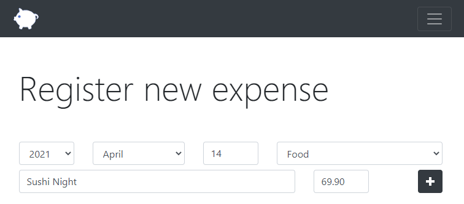
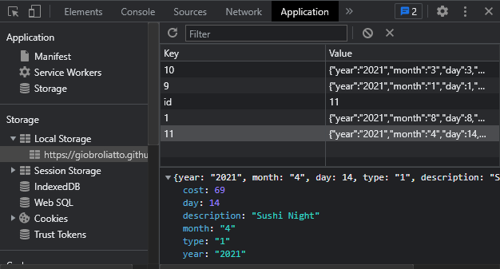
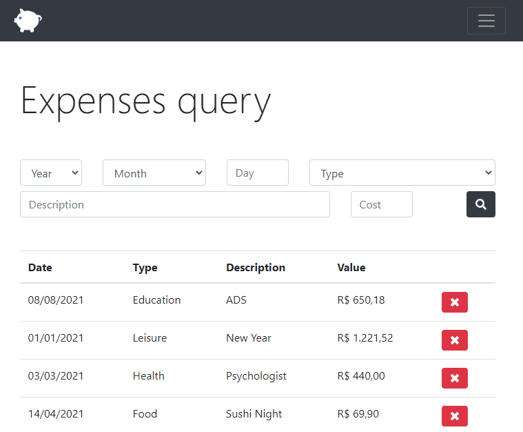

<h1 align="center">
     Personal Budget
</h1>

:moneybag: Using HTML, Bootstrap, Javascript, jQuery and a local storage, I (along with Web Developer's Course) created a system to register and store expenses, with date, type, description and cost information of each expense. :moneybag:

<h1 align="center">
    
</h1>

The system is coded to not allow invalid dates and cost values (such as characters on these fields), and also won't allow any empty field :lock::lock:. You can register as much expenses as you want, and it will be stored on your internal browser storage :package:. 

<h1 align="center">
    
</h1>

You can filter queries by any of the register information (day, month, year, type, description and cost), and you can delete the expense you want, with a safety alert to confirm that you really want to delete it :wastebasket:.

<h1 align="center">
    
</h1>

Besides all that, this was the first system that I developed using object-oriented programming paradigm, learning and improving the knowledge I had. :computer::keyboard:

#

 #### <h3 align="center">You can check the system [here](https://giobroliatto.github.io/personal-budget/)</h3>
